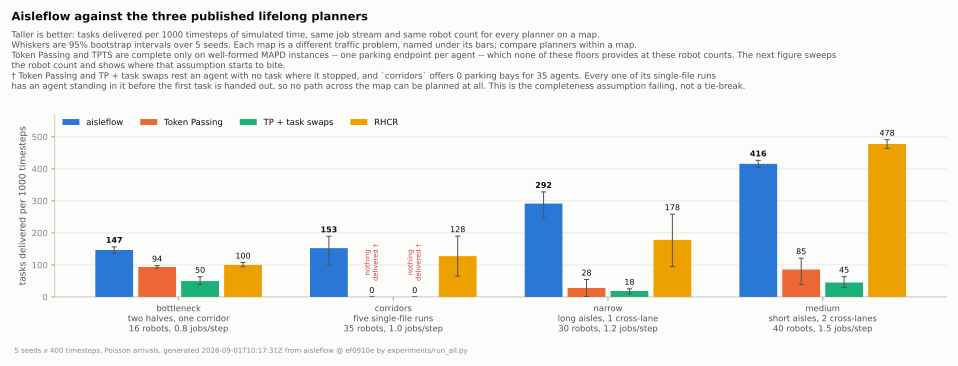

# aisleflow

A lifelong multi-robot warehouse planner. Dozens of robots on a grid, jobs
arriving continuously and never stopping, no collisions, as much throughput as
the floor will give.

The movement score is four terms and the whole planner has 37 parameters —
because every one of the ~45 it started with was measured, and everything that
changed nothing was deleted rather than left at a default. The evidence is in
[docs/05-results.md](docs/05-results.md); the reasoning is in
[docs/01-how-it-works.md](docs/01-how-it-works.md).



Aisleflow is measured against three published lifelong planners, each
implemented from its paper: **Token Passing** and **Token Passing with Task
Swaps** (Ma et al. 2017) and **RHCR** (Li et al. 2021, over PBS). It leads on
all four floors at the robot counts above — but the comparison that carries
information is the [density sweep](docs/05-results.md), which shows all four
planners level on a quiet floor and separating as it fills. Token Passing is
complete only on *well-formed* MAPD instances, meaning one parking endpoint
per agent, and none of these maps provides that at these robot counts; that
assumption running out is what the curves show.

The comparison that decides whether this project earned anything is not
against those three at all. It is against the plain lifelong PIBT it extends,
where it wins two floors and loses two — see
[the ablation ladder](docs/05-results.md).

## Documentation

| | |
|---|---|
| **[How it works](docs/01-how-it-works.md)** | Plain English, no symbols. |
| **[Decision flow](docs/02-decision-flow.md)** | Diagrams of one timestep, one move, one jam. |
| **[The maths](docs/03-the-math.md)** | Every formula, with a symbol table. |
| **[Parameters](docs/04-parameters.md)** | Every knob and the measured cost of removing it. |
| **[Results](docs/05-results.md)** | Baseline comparison and the evidence behind every deletion. |
| **[The maps](docs/06-the-maps.md)** | What the five warehouse floors are, and why each is a different problem. |

## The algorithm in a paragraph

Each timestep every robot scores its at-most-five options. Getting closer to
the goal is worth 10 and a move changes distance by exactly one, so the options
fall into tiers ten points apart; staying in your lane, not turning and
avoiding the crowd total under 4, so they break ties *within* a tier and never
across one. Conflicts are then resolved by pushing: if I want your cell I ask
you to move, lending you my rank; if nobody can move I stay put, which is
always legal, so a valid joint move always exists. Waiting buys rank at a fixed
rate, so after 80 steps a robot outranks anything and nothing starves.


## Quickest start

No install, no virtualenv, no dependencies — the simulator is pure standard
library:

```bash
git clone <your-repo-url> aisleflow
cd aisleflow
python3 main.py                                       # opens the GUI on a bundled map
python3 main.py gui maps/warehouse_medium.map -n 40    # same CLI as `lda-pibt` below
```

`main.py` just puts `src/` on the import path and forwards to the same CLI as
an installed package — every command below works identically as
`python3 main.py <command> ...` with nothing installed.

## Install (optional)

Only needed for the `lda-pibt` console command, the test suite, or GIF export:

```bash
pip install -e ".[dev]"      # or: pip install -e .   (no viz, no pytest)
pytest                       # 158 tests, ~15s
pytest -m slow               # the wide baseline sweep, 12 more, ~14s
pytest -m ""                 # everything, ~27s
```

The default run deselects `slow`, which is the baseline planners re-checked on
four extra maps. Those planners re-solve a space-time A\* per robot per
timestep, so that sweep alone cost more than the rest of the suite; the three
maps the default run keeps cover the same three failure modes. CI should run
`pytest -m ""`.

Python 3.10+.

## The GUI

```bash
lda-pibt gui maps/warehouse_medium.map -n 40 --rate 1.5
# or, with nothing installed:
python3 main.py gui maps/warehouse_medium.map -n 40 --rate 1.5
```

Opens a browser on `http://127.0.0.1:8000`. No extra dependencies — the backend
is `http.server` and the frontend is one self-contained HTML file, so it runs
over SSH with a forwarded port too (`--host 0.0.0.0`, `--no-browser`).

```
┌──────────────┬─────────────────────────────────────┬────────────────┐
│ map, variant │  ▶ Play  Step  +10  +100   Overlay  │ live metrics   │
│ robots, seed │ ┌─────────────────────────────────┐ │ + sparklines   │
│ arrival,rate │ │                                 │ │                │
│              │ │   warehouse canvas: robots,     │ │ INSPECTOR      │
│ ablation     │ │   aisle direction arrows,       │ │ robot #12      │
│ switches     │ │   routes, congestion heatmap    │ │ stalled 47     │
│              │ │                                 │ │ waiting for R7 │
│ α β γ λ μ ξ  │ └─────────────────────────────────┘ │ ─ why it moved │
│ sliders …    │  free · pickup · delivery · FORWARD │   there ─      │
└──────────────┴─────────────────────────────────────┴────────────────┘
```

**Click a robot and you get the answer to "why is it stuck?"** The inspector
lists every candidate cell with its score and the exact rule that rejected it —
`aisle-direction`, `no-reservation`, `vertex-conflict`, `kinematics` — in spec
§22.1 order. A stalled robot almost always shows the same reason on every
candidate, which names the culprit immediately. This is the diagnostic that
found all five bugs listed below; it is now a first-class feature
(`PIBTPlanner.explain_candidates`), usable from the library as well.

Also in there:

- **Aisle overlay** — every aisle tinted by state (OPEN / FORWARD / REVERSE /
  DRAINING) with flow arrows. Watch drain-before-reverse happen.
- **Heatmaps** — local congestion, or per-robot stall time, so jams are visible
  before you go looking for them.
- **Click an aisle** — state, direction, occupancy vs capacity, lock expiry,
  switch count, live reservation holders, and whether it is managed at all.
- **Live parameter sliders** — α, β, γ, λ, μ, ξ, `R_near`/`R_far`, `T_min`,
  `τ_switch`, capacity, drain timeout. Changing one restarts the run with the
  same seed, so A/B-ing a weight takes two seconds.
- **Ablation switches** as checkboxes: hysteresis, reservations, congestion,
  recovery, turning cost, direction-aware routing.
- Keyboard: `space` play/pause, `.` step, `r` reset.

Every control is also a JSON endpoint (`/api/state`, `/api/step`,
`/api/robot?id=N`, `/api/heatmap?kind=…`, `/api/config`), so you can drive the
simulator from a notebook or a script without the browser.

## Run it from the command line

`lda-pibt` below requires `pip install -e .`; swap in `python3 main.py` for
any of these with nothing installed — same commands, same flags.

```bash
# interactive GUI (see above)
lda-pibt gui maps/warehouse_medium.map -n 40

# structure of a warehouse: aisles, intersections, bottlenecks, reachability
lda-pibt inspect maps/warehouse_medium.map

# one lifelong simulation
lda-pibt run maps/warehouse_medium.map -n 40 -t 400 --rate 1.5 --variant full_lda_pibt

# the ablation table of spec section 34
lda-pibt ablate maps/warehouse_corridors.map -n 35 -t 400 --seeds 3

# a published baseline instead of the PIBT layer -- same CLI, same metrics
lda-pibt run maps/warehouse_medium.map -n 12 -t 400 --variant token_passing

# ASCII frames, or an animated gif (needs matplotlib + pillow)
lda-pibt animate maps/warehouse_small.map -n 8 -t 120 --stride 20
lda-pibt animate maps/warehouse_small.map -n 8 -t 120 --out run.gif

# override any parameter
lda-pibt run maps/warehouse_narrow.map -n 30 --set minimum_aisle_lock_time=8 \
                                            --set direction_aware_routing=true
```

Everything is also a library:

```python
from lda_pibt import Warehouse, TaskGenerator, ablation, build_simulator, Params

params    = ablation("full_lda_pibt", Params(seed=7))
warehouse = Warehouse.from_file("maps/warehouse_medium.map", params)
tasks     = TaskGenerator(warehouse.pickup_vertices,
                          warehouse.delivery_vertices,
                          mode="poisson", rate=1.5, seed=7)

sim    = build_simulator(warehouse, n_robots=40, params=params, task_generator=tasks)
report = sim.run(max_timesteps=400)

print(report)                  # human-readable summary
report.save("results/run.json")
```

## Map format

Plain text, one character per cell. Lines starting with `//` are comments.

| char | meaning | | char | meaning |
|---|---|---|---|---|
| `.` | free floor | | `k` | parking bay |
| `@` `#` | shelf / obstacle | | `b` | bottleneck (also auto-detected) |
| `p` | pickup station | | `y` | passing bay |
| `d` | delivery station | | | |

Everything else — aisle boundaries, intersections, capacities, articulation
points, bridge edges, dead ends — is derived automatically.

Bundled maps: `warehouse_small`, `warehouse_medium`, `warehouse_narrow`,
`warehouse_corridors` (parallel head-on corridors), `warehouse_bottleneck`
(two halves joined by one long corridor), plus `corridor` and `loop` for
tests. [**docs/06-the-maps.md**](docs/06-the-maps.md) draws all five to scale
and gives the measured structure of each — aisle lengths, junction counts, and
which cells a stationary robot can cut the floor at.

## Repository layout

```
maps/            warehouse maps
src/lda_pibt/    the package (see the module table above)
src/lda_pibt/gui/  browser GUI (server.py + static/index.html)
src/lda_pibt/baselines/  Token Passing, TPTS and RHCR, each from its paper
src/lda_pibt/viz_compare.py  side-by-side animation of two planners on one scenario
tests/           graph, PIBT, lifelong layer, GUI, baselines, statistics, the
                 committed doc assets, and the documents themselves (every
                 parameter documented, every generated table current)
experiments/     run_sensitivity.py (what each knob is worth) and run_all.py
                 (the ablation ladder, baselines, hypotheses, paired designs
                 and factorials) -- both write docs/data/. Plus the older
                 single-purpose runners, which write to results/.
results/         JSON from the individual runners (git-ignored)
tools/           make_docs_tables.py (the generated tables in docs/04 and 05),
                 make_figures.py (the figures), make_gifs.py (the animations)
docs/*.md        the five documents, in reading order
docs/data/       the measured dataset every figure and table is generated from
docs/figures/    the five result figures, as SVG, all embedded in docs/05
docs/gifs/       the comparison animations
```

## Citation

The underlying algorithm:

> K. Okumura, M. Machida, X. Défago, Y. Tamura.
> *Priority Inheritance with Backtracking for Iterative Multi-agent Path Finding.*
> arXiv:1901.11282.

The baselines in `src/lda_pibt/baselines/`. Token Passing (Algorithm 1) and
Token Passing with Task Swaps (Algorithm 2) both come from:

> H. Ma, J. Li, T. K. S. Kumar, S. Koenig. *Lifelong Multi-Agent Path Finding
> for Online Pickup and Delivery Tasks.* AAMAS 2017.

RHCR, and the PBS solver it runs over:

> J. Li, A. Tinka, S. Kiesel, J. W. Durham, T. K. S. Kumar, S. Koenig.
> *Lifelong Multi-Agent Path Finding in Large-Scale Warehouses.* AAAI 2021
> (Rolling-Horizon Collision Resolution).

> H. Ma, D. Harabor, P. J. Stuckey, J. Li, S. Koenig. *Searching with
> Consistent Prioritization for Multi-Agent Path Finding.* AAAI 2019
> (Priority-Based Search).

## License

MIT — see `LICENSE`.
