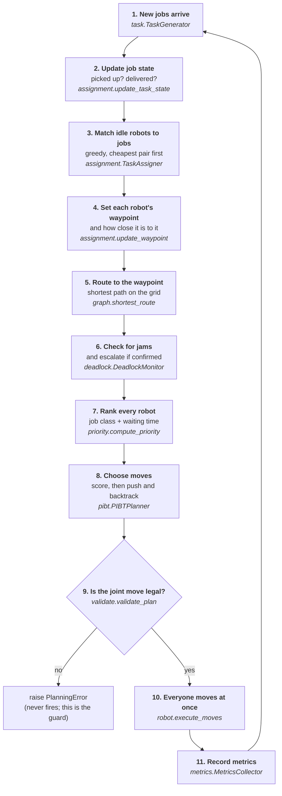
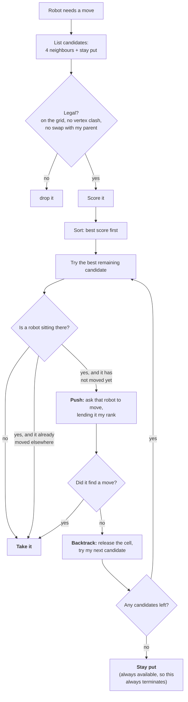
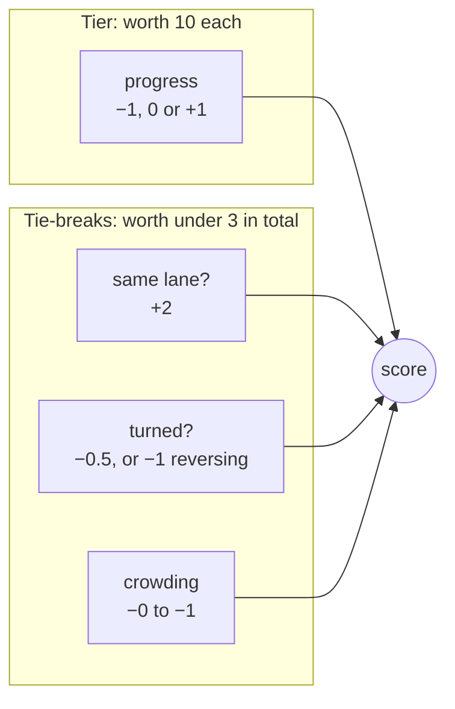
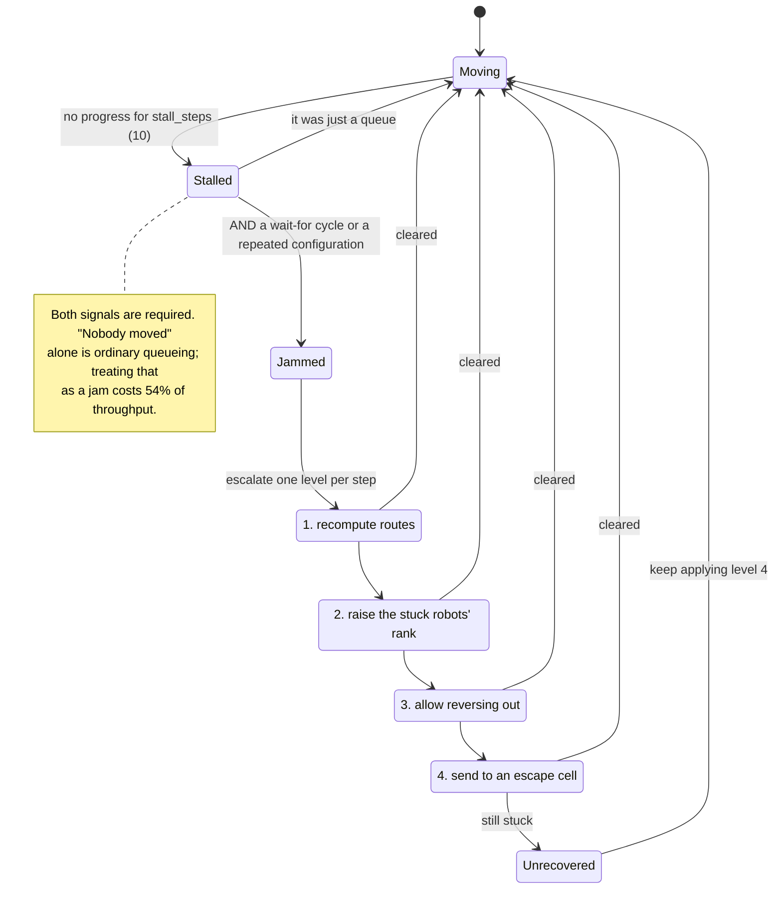

# Decision flow

*What happens each timestep, in order, and where each decision is made.*

## One timestep

All robots move simultaneously. A step is a pipeline: decide who does what,
decide where everyone wants to go, resolve the conflicts, then execute.

Steps 1–7 are advisory: they express what each robot *wants*. Step 8 is the
only one that decides what actually happens, and step 9 proves it was legal.

## Choosing one robot's move

The push in the middle is priority inheritance: the robot being asked
temporarily acts with the rank of whoever asked, so a whole chain can shuffle
aside for one important robot. The fallback at the bottom is why the algorithm
cannot fail — staying put is always legal, so every robot always gets a move.

**Nothing in this diagram consults a rule about which way a corridor should
flow.** Aisle direction used to appear twice here, as a candidate filter and as
a score penalty. Both are gone; see [05-results.md](05-results.md).

## Scoring one candidate cell

Because progress is worth 10 and moves it by a whole unit, candidates fall into
three bands ten points apart. The tie-breaks total under 3, so **they can
reorder candidates within a band but never across one**. Progress always wins.
That property is asserted by a test, so a future term cannot quietly break it.

## Detecting and clearing a jam

The ladder used to have seven rungs. Truncating it here measured **better**
than running all seven — the strongest remedies rewrote routes faster than the
jam was clearing. Per-level counters (`recovery_lN_fires`,
`recovery_lN_resolved`) record how often each rung runs and how often the jam
clears just after, so this stays checkable rather than assumed.
