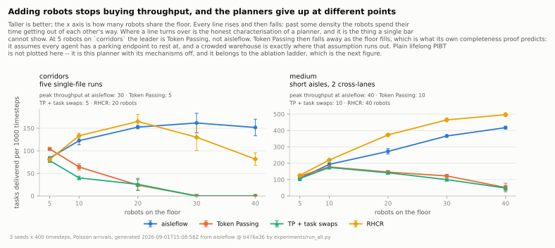
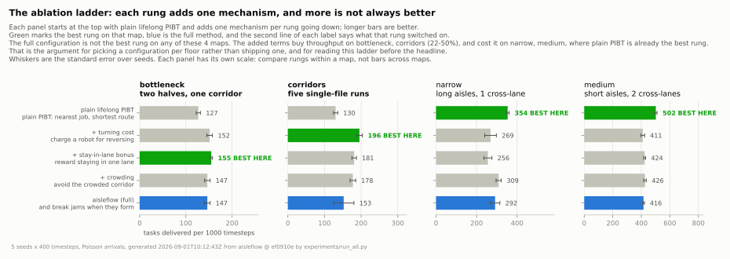
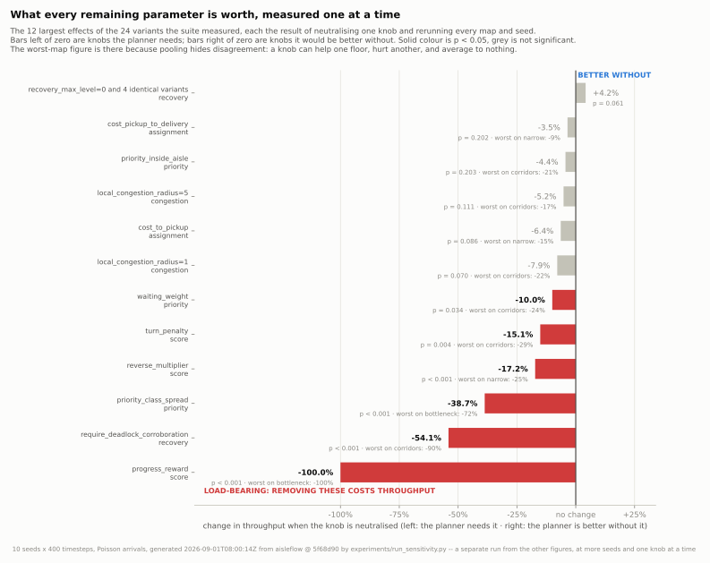

# Results

Five figures carry this page, and each one is generated from `docs/data/` by
`tools/make_figures.py`, so nothing here is drawn by hand or left behind when
the planner changes. [Page 06](06-the-maps.md) says what the maps are; every
number below is a number about one of them.

## Against the published planners

Three published lifelong (MAPD) planners, each implemented from its paper in
`src/lda_pibt/baselines/`:

| | |
| --- | --- |
| **Token Passing** (TP) | Ma, Li, Kumar & Koenig, AAMAS 2017, Algorithm 1. A shared token holds the task set, the assignment and every agent's path. An agent that reaches the end of its path takes the nearest task whose endpoints nobody is resting on, plans one path through pickup and delivery against the token, and follows it without replanning. |
| **TP with Task Swaps** (TPTS) | The same paper, Algorithm 2. An agent may take a task already assigned to another agent that has not yet picked it up, if it would reach the pickup sooner. |
| **RHCR** | Li, Tinka, Kiesel, Durham, Kumar & Koenig, AAAI 2021. Replan every `h` steps over a `w`-step window, resolving collisions only inside that window, with PBS as the solver — the choice that paper uses by default. |


<!-- generated:headline -->
| Planner | bottleneck | corridors | narrow | medium |
| --- | ---: | ---: | ---: | ---: |
| **Aisleflow (shipped configuration)** | 0.147 | 0.153 | 0.291 | 0.416 |
| Token Passing (Ma et al. 2017, Alg. 1) | 0.099 | 0.000 | 0.023 | 0.068 |
| TP + task swaps (Ma et al. 2017, Alg. 2) | 0.051 | 0.000 | 0.018 | 0.040 |
| RHCR (Li et al. 2021, PBS) | 0.158 | 0.093 | 0.210 | 0.484 |
| Plain lifelong PIBT (ablation reference) | 0.127 | 0.131 | 0.354 | 0.502 |

*Tasks delivered per timestep; higher is better. 5 seeds x 400 steps, identical job streams across planners. git `0930d9a`.*
<!-- /generated:headline -->

**What to look for:** this is a split decision, not a sweep, and most of it is
not even a decision. **RHCR beats aisleflow on two of the four floors** — 484
tasks per 1000 timesteps against 416 on `medium`, and 158 against 147 on
`bottleneck` — while aisleflow is ahead on `corridors` and `narrow`. But at
five seeds only one of those four differences separates: `medium`, where RHCR
is ahead at p = 0.008. On the other three the permutation test returns p =
0.33, 0.14 and 0.33, and the figure marks them `n.s.`

The defensible statement is therefore: **aisleflow and RHCR are within noise
of each other on three of these four floors, and RHCR is measurably better on
the fourth.** Against Token Passing and TPTS aisleflow is ahead everywhere,
and the next figure is about how much that is worth.

Token Passing delivers nothing at all on `corridors`, which is a fact about
that map rather than about the algorithm: it has no parking bays, so with 35
agents every one of its five single-file runs has an idle agent standing in it
before the first task is handed out.

Even this split decision is a weaker claim than it looks, and the next figure
is why.

## …and what that comparison is worth



A single bar chart measures a planner at one point on a curve. Sweep the
robot count instead and the shape of the comparison changes completely:

| Planner | `corridors` 5 | `corridors` 20 | `corridors` 40 | `medium` 5 | `medium` 20 | `medium` 40 |
| --- | ---: | ---: | ---: | ---: | ---: | ---: |
| aisleflow | 84 | 152 | **152** | 108 | 272 | 418 |
| Token Passing | **104** | 24 | 0 | 121 | 146 | 52 |
| TP + task swaps | 78 | 26 | 0 | 107 | 142 | 48 |
| RHCR | 81 | **165** | 82 | **126** | **373** | **497** |

*Tasks per 1000 timesteps, 3 seeds. Bold is the best in that column.*

Three things fall out of that table, and none of them is visible in the bar
chart above it.

**On a quiet floor Token Passing is the strongest planner in the study.** At
five robots on `corridors` it delivers 104 against aisleflow's 84, and on
`medium` it is level with everything else. That is the number that says these
implementations are right: a faithful published algorithm, on an instance
inside its own assumptions, beating the thing this project ships.

**RHCR is ahead of aisleflow almost everywhere.** It leads at every density on
`medium` and up to 20 robots on `corridors`. The single region where aisleflow
is clearly better is **single-file corridors at high density** — 152 against
82 at 40 robots — which is exactly the regime its congestion machinery was
built for, and is a much narrower claim than the bar chart alone suggests.

**Token Passing falls away as the floor fills.** Ma et al. prove TP complete
on *well-formed* MAPD instances — every agent has a parking endpoint to rest
at, and any two endpoints are joined by a path traversing no other endpoint.
An idle Token Passing agent stays where it finished. On a floor with
one-cell-wide aisles and two parking bays for thirty agents, where it finished
is in somebody's way, and enough idle agents cut the warehouse into pieces
that no path crosses. `warehouse_corridors` has **no** parking bays at all
([page 06](06-the-maps.md)), which is why the line reaches exactly zero rather
than merely declining.

PIBT has no such assumption, because it never plans a path it has to reserve.
A blocked robot lends its rank to the robot in its way and pushes; an idle
robot in a corridor is displaced by the first busy robot that needs the cell.
**That difference — not the scoring terms, not the crowding model, not the
recovery ladder — is what separates the two families at the right-hand ends of
those curves.** It is a property of PIBT, which this project did not invent.

So: the comparison against these three establishes that the planner is in the
right league and inherits PIBT's robustness to density. It does not establish
that anything *this project added* was worth adding — RHCR reaches higher
throughput than aisleflow on most of this grid without any of it. For that,
the reference has to be plain lifelong PIBT, aisleflow with every one of its
mechanisms switched off, and that comparison is the rest of this page.

## The finding that matters most

This is the comparison the project is actually about, and the one it cannot
duck: plain lifelong PIBT is aisleflow with every mechanism switched off, run
on the same maps, seeds and job streams. Every mechanism added on top helps
where an aisle is long and single-file and hurts where it is not. Across the
four maps, **the full configuration is not the best on any of them**:

<!-- generated:ladder -->
| Configuration | bottleneck | corridors | narrow | medium |
| --- | ---: | ---: | ---: | ---: |
| plain lifelong PIBT | 0.127 | 0.131 | **0.354** | **0.502** |
| + turning cost | 0.152 | **0.196** | 0.269 | 0.411 |
| + stay-in-lane bonus | **0.155** | 0.181 | 0.256 | 0.424 |
| + crowding | 0.147 | 0.178 | 0.309 | 0.426 |
| + deadlock recovery (full) | 0.147 | 0.153 | 0.291 | 0.416 |

*Tasks per timestep; **bold** is the best configuration for that map. 5 seeds x 400 steps, git `ef0910e`.*
<!-- /generated:ladder -->



**What to look for:** read each panel top to bottom — every rung adds one
mechanism. If more were always better, the green "best here" marker would sit
on the bottom rung of all four panels. It sits there on none of them.

On `bottleneck` and `corridors` the best rung buys 22% and 50% over plain
PIBT. Both commit a robot to a long single-file run it cannot turn round in:
the six-cell corridor joining the halves, or a 22-cell rung of the ladder. On
`narrow` and `medium` the aisles are short enough to back out of, plain PIBT
is itself the best rung — by 13% and 15% over the best configuration that adds
anything — and every addition costs.

This is not a defect to hide; it is the most useful thing the study produced.
It says the machinery is *congestion machinery*, and it earns its keep exactly
where congestion is the binding constraint. Where a robot can back out of an
aisle cheaply, getting out of the robots' way is the better strategy. The
density sweep says the same thing from the other direction: the one region
where aisleflow is clearly ahead of RHCR is single-file corridors at high
density.

**Practical consequence:** pick the configuration for the floor, not the other
way round. `turning_cost_only` is the best single choice for tight maps,
`lifelong_pibt` for open ones, and `full_lda_pibt` is the safe middle that is
never worst. The defaults ship as the full configuration because it is the one
with a deadlock safety net, not because it wins the throughput table.

## What this pass changed

The planner had ~45 hand-chosen numbers across seven separate models, none with
published justification. Every one was measured. The result:

| | before | after |
|---|---:|---:|
| terms in the movement score | 9 | 4 |
| tunable parameters | 60 | 37 |
| lines in the planner modules | 4,488 | 3,249 |
| throughput, per map | — | **+1.4%, +26.0%, +32.7%, +50.6%** |

*(Line count covers the planner itself — scoring, PIBT, priority, crowding,
assignment, deadlock, the simulator loop, the warehouse and graph — not the
GUI, visualisation or experiment harness. Throughput is the full configuration
on `bottleneck`, `corridors`, `medium` and `narrow`, 5 seeds x 400 steps.)*

Every run in every experiment reports `collision_free: true`, before and after.
Nothing removed had anything to do with collision safety — only PIBT's vertex
and swap checks provide that.

### The three findings that drove it

**1. The score was mostly decorative.** Progress is worth 10 and a move changes
distance by exactly ±1, so candidates fall into tiers ten points apart.
Every other term totalled under 4, so it could only reorder *within* a tier.
Five of the nine terms were smaller than a tie-break and never changed a
decision: runs without them were **bit-identical** on every deterministic
metric, every seed, every map.

**2. The one-way aisle mechanism cost throughput.** The planner's headline
feature charged a robot for moving against its aisle's committed direction, and
for entering one without a permit. Removing the permit penalty alone raised
throughput 33.6% (p < 0.0001); removing it together with the counterflow
penalty and the heading term raised it 39.6% with no map made worse.

**3. With those gone, the whole aisle-direction layer measured nothing.** The
demand vote, the green/drain state machine, maximum green, direction-aware
routing — 450 lines — came to **−0.3% (p = 0.95)**, swinging between −12% and
+9% by map. That is noise, not a mechanism, so it was deleted. Aisles remain as
*geometry*: the score still rewards staying in one lane, and crowding is still
measured per corridor.

### Two bugs found by measuring

- **Maximum green never fired for negative voters.** The starvation rule tested
  `opposing_demand > 0`, but the demand score is signed — a long remaining route
  and a crowded aisle subtract from it — so legitimate traffic routinely voted
  negative and was not counted. Aisles held one direction for 130 steps against
  robots that plainly wanted through.
- **A rename silently ate overrides.** `LEGACY_NAMES` was itself caught by the
  rename sweep, so its keys became the *new* names mapping to themselves. The
  alias expansion pops every key it recognises, so `merged(turn_penalty=1.5)`
  returned the default 0.5 — no error, no warning. A test now forbids the
  collision.

## Every knob, measured



**What to look for:** the bars that reach far left are the parameters the
planner cannot do without — the progress reward, the deadlock corroboration
rule, the job-class ordering. Everything clustered near the line is a knob that
measured nothing, and the grey bars are the ones that did not clear p < 0.05.

Negative means removing the knob costs throughput; positive means the planner
is better without it.

<!-- generated:sensitivity -->
| Family | Knob neutralised | Pooled effect | p | Worst map |
| --- | --- | ---: | ---: | --- |
| score | `progress_reward` | -100.0% | 0.000 | bottleneck (-100.0%) |
| recovery | `require_deadlock_corroboration` | -54.1% | 0.000 | corridors (-90.2%) |
| priority | `priority_class_spread` | -38.7% | 0.000 | bottleneck (-71.9%) |
| score | `reverse_multiplier` | -17.2% | 0.000 | narrow (-24.5%) |
| score | `turn_penalty` | -15.1% | 0.004 | corridors (-28.9%) |
| priority | `waiting_weight` | -10.0% | 0.034 | corridors (-23.8%) |
| congestion | `local_congestion_radius=1` | -7.9% | 0.070 | corridors (-22.0%) |
| assignment | `cost_to_pickup` | -6.4% | 0.086 | narrow (-15.1%) |
| congestion | `local_congestion_radius=5` | -5.2% | 0.111 | corridors (-16.7%) |
| priority | `priority_inside_aisle` | -4.4% | 0.203 | corridors (-20.9%) |
| assignment | `cost_pickup_to_delivery` | -3.5% | 0.202 | narrow (-8.7%) |
| recovery | `stall_steps` | -2.9% | 0.050 | corridors (-6.5%) |
| assignment | `cost_waiting_cap` | -2.8% | 0.116 | corridors (-8.2%) |
| score | `aisle_bonus/aisle_bonus_near` | -2.6% | 0.475 | narrow (-11.4%) |
| assignment | `cost_congestion` | -2.4% | 0.503 | corridors (-9.1%) |
| score | `crowding_penalty` | -0.3% | 0.913 | corridors (-16.2%) |
| recovery | `recovery_max_level=4` | +0.0% | 1.000 | — |
| assignment | `cost_blocking` | +0.0% | 0.744 | — |
| assignment | `cost_waiting` | +0.1% | 0.984 | corridors (-11.7%) |
| recovery | `recovery_max_level=0` | +4.2% | 0.061 | — |
| recovery | `recovery_max_level=1` | +4.2% | 0.061 | — |
| recovery | `recovery_max_level=2` | +4.2% | 0.061 | — |
| recovery | `recovery_max_level=3` | +4.2% | 0.061 | — |
| recovery | `recovery` | +4.2% | 0.061 | — |

*24 variants, 10 seeds, 400 steps, 4 maps. Effect is the change in throughput from removing the knob, so a positive number means the planner is better without it. Paired sign-flip test; git `5f68d90`.*
<!-- /generated:sensitivity -->

### Caveats worth stating

- **Every scenario is saturated.** Jobs arrive faster than any of these
  planners can deliver them — `corridors` releases about 390 jobs in 400 steps
  and the best planner clears about 60 — so throughput measures the *capacity*
  of the floor, not responsiveness, and the queue grows without bound behind
  every planner. Service time under saturation is a function of how long the
  run was, so it is recorded but not compared across planners.
- **Two of the three published baselines are measured outside their design
  envelope, and that is stated rather than scored.** Token Passing and TPTS
  assume a well-formed MAPD instance (see [page 06](06-the-maps.md)) and none
  of these maps is one at these robot counts. RHCR has no such assumption, and
  it is ahead of aisleflow at most points on the density grid. Read the
  density figure before reading anything into the bar chart: on a quiet floor
  Token Passing is the *best* planner in the study, which is what says the
  implementations are right.
- **Five seeds does not separate much.** Of the four aisleflow-against-RHCR
  differences in the headline table, one is significant at p < 0.05. The
  figure marks the rest `n.s.` rather than letting a mean difference read as a
  result, and the honest summary of that table is "within noise on three
  floors, behind on the fourth".
- **Four maps.** Every conclusion here is about `warehouse_bottleneck`,
  `warehouse_corridors`, `warehouse_narrow` and `warehouse_medium` at the
  robot counts and arrival rates in the dataset's `meta.scenarios`. A knob
  that is inert here may matter on a map with longer, tighter corridors.
- **Pooling hides disagreement.** The worst-map column exists because a knob
  can help on one map and hurt on another and average to zero. Read it.
- **`recovery` is a genuine trade-off, not a free win.** Turning deadlock
  recovery off raises throughput 4.2%, but jams then go unresolved (6.4 per run
  on corridors, against 0.3) and p95 service time gets *worse*. It was kept.
  Its detection rule, though, is the second most load-bearing thing in the
  planner: accepting "nobody moved" as a jam, without requiring a wait-for
  cycle or a repeated configuration, costs **54%** of throughput, because
  ordinary queueing then trips recovery constantly.
- **No multiple-comparison correction.** 23 knobs at α = 0.05 means roughly one
  false positive is expected. The load-bearing findings are far past that
  threshold; the marginal ones should be treated as suggestive.

## Reproducing

```bash
pip install -r requirements-dev.txt
python3 experiments/run_sensitivity.py --seeds 10 --jobs 4
python3 experiments/run_all.py --only ablation hypotheses paired factorial --seeds 5
python3 experiments/run_all.py --only baselines --seeds 5 --jobs 4
python3 experiments/run_all.py --only density  --seeds 3 --jobs 4
python3 tools/make_docs_tables.py                            # refresh this page
python3 tools/make_figures.py
```

The `baselines` and `density` suites are the slow ones by two orders of
magnitude, and they are slow for a reason worth knowing: Token Passing runs a
space-time A\* per agent per task, and on a floor where most agents cannot
reach any task it runs one per agent per *timestep* and fails. That is the
algorithm doing what its paper says, so it is left alone and given `--jobs`
instead. Budget an hour or two for those two; the rest is a few minutes.

Every dataset in `docs/data/` carries a `meta` block with the git SHA, the
seeds, the horizon and the exact scenarios, so any row here can be traced to
the run that produced it.

## Animations

Side-by-side runs sharing a map, a seed, a robot count and a job stream, and
differing only in the planner. Red means a robot has not moved for 15 steps.


Four more — the turning cost on a tight floor, RHCR keeping pace by replanning
a window instead of pushing, what the deadlock corroboration rule is worth,
and the open-map case this planner loses — are in
**[gifs/README.md](gifs/README.md)**, each with its narration written out beat
by beat. Every number quoted in a caption is looked up from `docs/data/` when
the animation is rendered, so a regenerated dataset cannot leave the narration
behind.

Rebuild with `python3 tools/make_gifs.py`.
