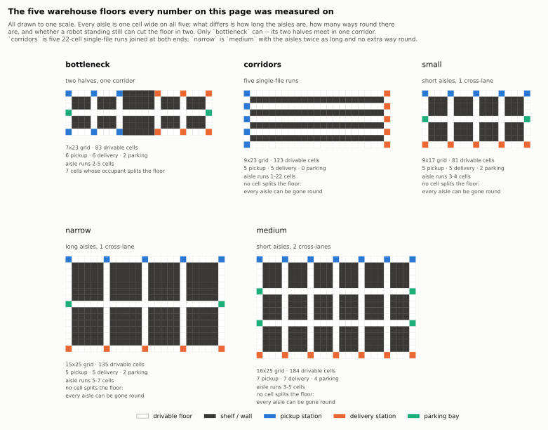

# The maps

Every number in [05 — Results](05-results.md) is a number *about a floor*. A
planner is not fast or slow in general; it is fast or slow on a layout, at a
robot count, under an arrival rate. This page says what the layouts are, so
"aisleflow wins on `corridors` and loses on `medium`" is a sentence with
content rather than two map names.



All five are drawn to the same scale in that figure. Every aisle on every map
is **one cell wide** — two robots cannot pass inside an aisle, only at its
ends. What differs between the maps is three things, and they are the three
things that decide how hard the traffic problem is:

1. **How long the aisles are.** A 22-cell single-file run commits a robot for
   22 steps; a 3-cell one commits it for 3.
2. **How many ways round there are.** A robot that meets an oncoming robot has
   to reverse unless there is another route.
3. **Whether one stationary robot can cut the floor in two.** On four of the
   five maps it cannot. On `bottleneck` it can, and does.

## The five floors

<!-- generated:maps -->
| Map | Grid | Drivable cells | Pickup / delivery / parking | Aisle length | Aisles | Junctions | Cells that split the floor |
| --- | --- | ---: | ---: | ---: | ---: | ---: | ---: |
| `warehouse_bottleneck` | 7x23 | 83 | 6 / 6 / 2 | 2-5 | 25 | 10 | 7 |
| `warehouse_corridors` | 9x23 | 123 | 5 / 5 / 0 | 1-22 | 13 | 6 | 0 |
| `warehouse_narrow` | 15x25 | 135 | 5 / 5 / 2 | 5-7 | 22 | 11 | 0 |
| `warehouse_small` | 9x17 | 81 | 5 / 5 / 2 | 3-4 | 22 | 11 | 0 |
| `warehouse_medium` | 16x25 | 184 | 7 / 7 / 4 | 3-5 | 45 | 24 | 0 |
| `corridor` | 1x11 | 11 | 1 / 1 / 0 | 11-11 | 1 | 0 | 9 |
| `loop` | 5x5 | 18 | 3 / 3 / 1 | 1-4 | 8 | 2 | 2 |

*Derived from the map files by `tools/make_docs_tables.py`; nothing here is declared in the map format except which cells are floor, shelf, pickup, delivery and parking. "Cells that split the floor" are graph articulation points: a robot standing on one disconnects part of the warehouse from the rest.*
<!-- /generated:maps -->

### `warehouse_bottleneck` — two halves joined by one corridor

```
p...p...p@@@@@d...d...d
.@@@.@@@.@@@@@.@@@.@@@.
.@@@.@@@.@@@@@.@@@.@@@.
k.......b.....b.......k
.@@@.@@@.@@@@@.@@@.@@@.
.@@@.@@@.@@@@@.@@@.@@@.
p...p...p@@@@@d...d...d
```

Every pickup is on the left, every delivery is on the right, and the only
route between them is the six-cell corridor in the middle row (marked `b`).
Every task crosses it, in both directions, forever.

This is the map that separates planners that can resolve a head-on meeting
from planners that can only avoid one. It is also the only map here that is
**not** two-connected: seven of its 83 cells are articulation points, so a
robot that stops in the wrong place cuts the warehouse in half. That matters a
great deal to Token Passing, which parks idle agents wherever they finished —
see the caveat at the end of this page.

Scenario used in the results: **16 robots, 0.8 jobs per timestep.**

### `warehouse_corridors` — five single-file runs

```
p.....................d
.@@@@@@@@@@@@@@@@@@@@@.
p.....................d
.@@@@@@@@@@@@@@@@@@@@@.
p.....................d
.@@@@@@@@@@@@@@@@@@@@@.
p.....................d
.@@@@@@@@@@@@@@@@@@@@@.
p.....................d
```

A ladder: five 22-cell corridors, each one cell wide, joined at both ends by
the two vertical side columns. A robot that enters a corridor is committed to
it for 21 steps, and a robot entering the other end at the same time is a
head-on meeting neither can resolve by stepping aside.

There are alternative routes — a robot can take a different rung — so the
floor never actually disconnects, but the *cost* of taking the wrong rung is
the whole length of it. This is the map where staying in lane and charging for
reversals pay for themselves most clearly.

It is also the only bundled map with **no parking bays at all**, which makes
it the hardest instance on this page for any planner that needs somewhere to
put an idle robot.

Scenario used in the results: **35 robots, 1.0 jobs per timestep.**

### `warehouse_narrow` — long aisles, one cross-lane

Seven-cell aisles between shelf blocks, with a single horizontal cross-lane
across the middle and pickups and deliveries on opposite ends of the building.
Structurally it is `medium` with the aisles roughly twice as long and no extra
way round, which is exactly the comparison it exists to support: it isolates
*aisle length* from *number of routes*.

Scenario used in the results: **30 robots, 1.2 jobs per timestep.**

### `warehouse_medium` — the default floor

Three-to-five-cell aisles, two horizontal cross-lanes, seven pickups along the
top and seven deliveries along the bottom. Enough room that a robot meeting
another one usually has somewhere to go, which is why the congestion machinery
measures as overhead here and plain PIBT wins.

Scenario used in the results: **40 robots, 1.5 jobs per timestep.**

### `warehouse_small` — the same shape, faster to run

`medium` with one cross-lane and four aisle blocks instead of six. Used by the
test suite and by the animations, where a 400-step run on `medium` would be
too slow to iterate on.

### `corridor` and `loop` — unit-test fixtures

`corridor` is eleven cells in a line with a pickup at one end and a delivery
at the other: the smallest instance on which two robots can deadlock. `loop`
is a five-by-five ring. Neither is used for results; both exist because a
collision-freedom test on an eleven-cell map fails in a way you can read.

## Reading the results against these maps

Two things follow from the table above and are worth having in mind before
page 05:

**The maps are saturated on purpose.** At the scenarios listed, jobs arrive
faster than any of these planners can deliver them — `corridors` releases
about 390 jobs in 400 steps and the best planner clears about 60. Throughput
therefore measures *capacity*, not responsiveness: it is the rate the floor
can sustain, and the queue grows without bound behind it either way. Service
time under saturation is a function of how long the run was, so it is reported
but not compared across planners.

**These are not well-formed MAPD instances.** Ma et al. (2017) prove Token
Passing complete on *well-formed* instances: every agent has a parking
endpoint to rest at, and any two endpoints are joined by a path that traverses
no other endpoint. None of these floors provides that at these robot counts —
`corridors` has no parking bays and 35 robots, `medium` has four bays and 40
robots — so an idle agent necessarily rests somewhere that is in somebody's
way. That assumption failing is the single largest reason Token Passing and
TPTS have no throughput at all on `corridors`, and a reduced one on
`bottleneck`, the floor [page 05](05-results.md) features. It is a property of
these maps meeting that algorithm, not a defect in either.
