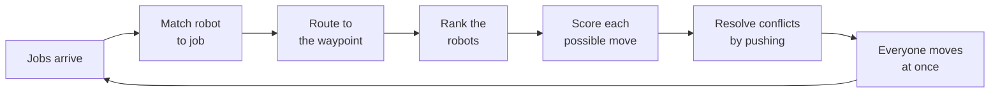

# Documentation

A lifelong multi-robot warehouse planner: dozens of robots on a grid, jobs
arriving continuously, no collisions, as much throughput as possible.



The movement score is four terms and the whole planner is 37 parameters,
because everything else was measured and deleted. Start with the first page.

| | |
|---|---|
| **[01 — How it works](01-how-it-works.md)** | Plain English, no symbols. The problem, the four ideas, and one robot followed for ten steps. |
| **[02 — Decision flow](02-decision-flow.md)** | Diagrams: one timestep end to end, how a move is chosen, how a jam is cleared. |
| **[03 — The maths](03-the-math.md)** | Every formula, with a symbol table and worked numbers. |
| **[04 — Parameters](04-parameters.md)** | Every knob, its default, and the measured cost of removing it. |
| **[05 — Results](05-results.md)** | The comparison against baselines, and the evidence behind every deletion. |

## The one-paragraph version

Each timestep, every robot scores its at-most-five options. Getting closer to
the goal is worth 10 and a move changes distance by exactly one, so options
fall into tiers ten points apart; staying in your lane, not turning, and
avoiding the crowd total under 4 and can only break ties within a tier.
Conflicts are then resolved by *pushing*: if I want your cell I ask you to
move, lending you my rank, and if nobody can move I stay put — which always
works, so a legal joint move always exists. Waiting buys rank, so nothing
starves. That is the entire algorithm.

## Data and figures

`data/` holds the experiment output — every file carries a `meta` block with
the git SHA, seed count, horizon and scenarios. `figures/` (five SVGs, all
embedded in page 05) and `gifs/` are generated from it:

```bash
python3 experiments/run_sensitivity.py --seeds 10 --jobs 4
python3 experiments/run_all.py --seeds 5
python3 tools/make_docs_tables.py
python3 tools/make_figures.py
python3 tools/make_gifs.py
```

The tables in pages 04 and 05 are generated between marker comments, and a test
fails if they drift from the data.
