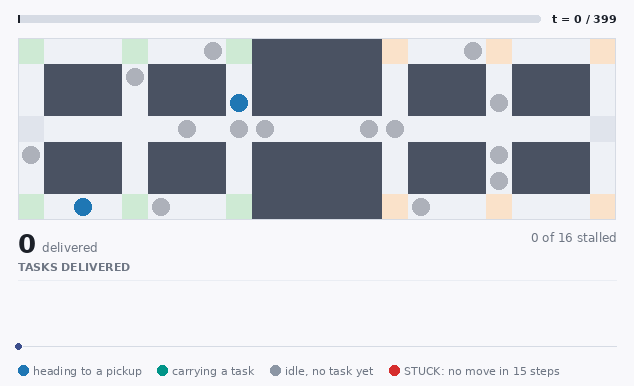

# Animation

One animation of aisleflow itself, on the floor where it leads every
published planner. It is a real, seeded run of the same simulator the
results table uses (`experiments.build_run`) -- same map, robot count,
arrival rate and task stream -- so the picture and the number in
[../05-results.md](../05-results.md) are the same run.

The frame itself carries no title, caption or narration -- that
explanation is here instead, generated from the same scenario
definition that renders the GIF, so the two cannot say different
things. The throughput this page quotes is read out of `../data/`
when the animation is rendered, so it is the same number as on the
results page and cannot be left behind by a regenerated dataset. It
is a mean over five seeds; a single seeded run is one draw from
that, so the GIF shows the mechanism rather than the average.

Regenerate it with:

```bash
python3 tools/make_gifs.py            # needs pillow: pip install -e ".[viz]"
```

## How to read it

It is built to be followed on a first watch: 2 timesteps a frame
at 5 frames a second, with a pause on the opening frame to read the
setup and a longer one on the last to read the outcome.

| On the frame | Means |
| --- | --- |
| Blue dot | a robot on its way to a pickup |
| Teal dot | a robot carrying a task to a delivery |
| Grey dot | a robot with no task yet |
| **Red dot** | that robot has not moved for 15 timesteps |
| Bar across the top | how far into the run this frame is |
| Big number | tasks delivered so far |
| Chart | tasks delivered over the whole run, drawn as it plays |

One colour rule carries most of the argument: **red means stuck**, and
nothing else on the frame is red. A floor that jammed would fill with
red and the chart under it would flatten; watch that this one does not.
The beat-by-beat narration below says, in words and cued to a
timestep, what the mechanism is doing at each stage of the run.

## Aisleflow clearing the one corridor every task must cross



**warehouse_bottleneck**, 16 robots, arrival rate 0.8, 400 timesteps, seed 0. `full_lda_pibt`.

Sixteen robots on `warehouse_bottleneck`: two halves of the floor joined by a single six-cell corridor, so every task must cross it one way and cross back the other. Aisleflow never plans a path it has to reserve -- a blocked robot lends its rank to the robot in its way and pushes, and an idle robot is simply displaced by the first busy one that needs its cell -- so the corridor drains instead of jamming. Nothing on the frame stays red for long: the queue keeps moving through the chokepoint. Measured over five seeds on this map it delivers 147 tasks per 1000 timesteps, ahead of every published planner. The full comparison, and the three baselines it beats, is on [../05-results.md](../05-results.md).

<details><summary>The narration, beat by beat</summary>

- **t = 0** -- warehouse_bottleneck: 16 robots, two halves joined by one six-cell corridor. Every task crosses it, both ways.
- **t = 60** -- Aisleflow plans no path it has to reserve, so there is no search to fail as the floor fills.
- **t = 150** -- A blocked robot lends its rank to the robot ahead and pushes; an idle robot is simply displaced.
- **t = 250** -- So the one corridor drains instead of gridlocking -- watch the queue keep moving through it.
- **t = 330** -- Five seeds on this map: 147 tasks per 1000 steps, ahead of every published planner.

</details>

```bash
python3 tools/make_gifs.py --only bottleneck
```
