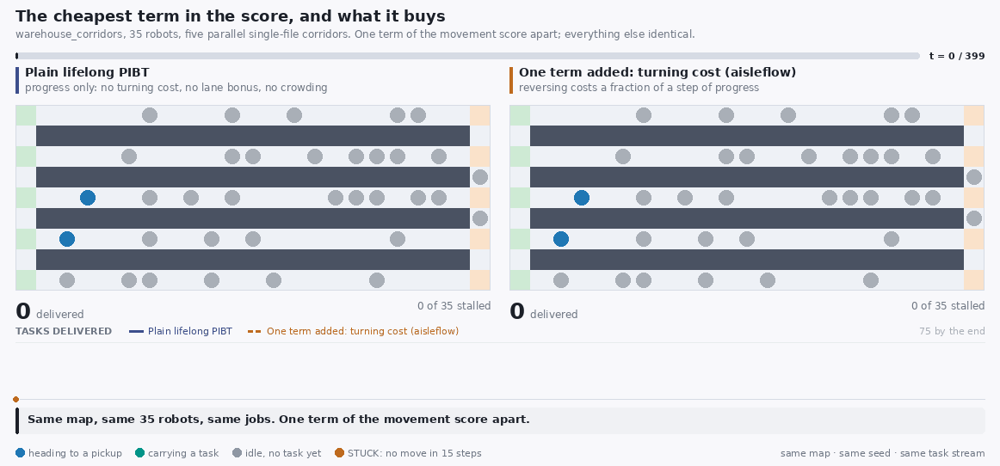
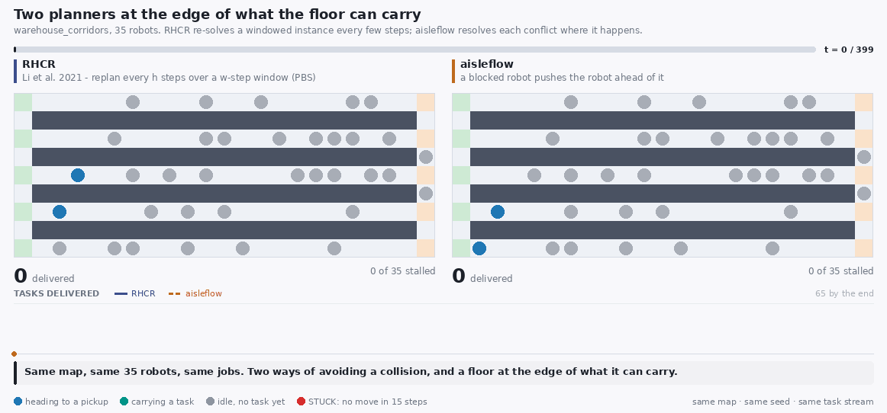

# Comparison animations

Five animations, each a claim this project makes shown as a picture.
Every panel is a real run of the simulator in this repository, and the two
panels of a frame share a map, a seed, a robot count, an arrival rate and a
task stream -- they differ in the planner and nothing else.

The numbers quoted below are read out of `../data/` when the animations
are rendered, so they are the same numbers as in
[../05-results.md](../05-results.md) and cannot be left behind by a
regenerated dataset. They are means over five seeds; a single seeded run
is one draw from that, so a GIF shows the mechanism rather than the
average.

Regenerate them all with:

```bash
python3 tools/make_gifs.py            # needs pillow: pip install -e ".[viz]"
```

## How to read one

They are built to be followed on a first watch, at two timesteps per frame,
with a pause on the opening frame to read the setup and a longer one on the
last to read the outcome.

| On the frame | Means |
| --- | --- |
| Blue dot | a robot on its way to a pickup |
| Teal dot | a robot carrying a task to a delivery |
| Grey dot | a robot with no task yet |
| **Red dot** | that robot has not moved for 15 timesteps |
| **Red frame + GRIDLOCKED** | most of that panel's robots are stuck |
| Big number | tasks delivered so far, green on whichever side is ahead |
| Chart | tasks delivered over the whole run, drawn as it plays |
| Band along the bottom | what is happening in this part of the run, and why |

One colour rule carries most of the argument: **red means stuck**, and
nothing else on the frame is red. A side that fills with red has stopped
delivering, and the chart under it flattens at the same moment.

## Two ways of getting past a robot that is in the way


**warehouse_bottleneck**, 16 robots, arrival rate 0.8, 400 timesteps, seed 0. `token_passing` vs `full_lda_pibt`.

The clearest picture of the one structural difference between these two families. Token Passing hands an agent a task only if it can plan a whole collision-free path through pickup and delivery against every other agent's committed path, and an agent with no task rests where it stopped. On this map -- two halves joined by a single six-cell corridor, with two parking bays for sixteen robots -- resting robots regularly sit in the corridor, and while one does, nobody on the left can plan a path to anywhere on the right. Watch the left panel go quiet in stretches: those are the intervals where no agent could be given work at all. PIBT never plans a path it has to reserve, so there is no search to fail: a blocked robot lends its rank to the robot in its way and pushes, and a resting robot is simply displaced. Measured over five seeds on this map: 147 tasks per 1000 timesteps against 94. Ma et al. prove Token Passing complete on *well-formed* instances -- one parking endpoint per agent -- which this map does not provide, and that is exactly the assumption you are watching run out.

<details><summary>The narration, beat by beat</summary>

- **t = 0** -- Same map, same 16 robots, same tasks. One corridor joins the two halves; there are two parking bays for sixteen robots.
- **t = 40** -- Left: Token Passing gives an agent a task only if it can plan the whole path first, against everyone else's.
- **t = 90** -- Left: an agent with no task rests where it stopped -- and here that is often inside the one corridor.
- **t = 150** -- While it sits there, nobody can plan a path across the map, so no task can be handed out at all.
- **t = 230** -- Right: PIBT plans no path to reserve. A blocked robot lends its rank to the robot ahead and pushes through.
- **t = 320** -- Five seeds on this map: 147 against 94 tasks per 1000 steps. The difference is pushing, not scoring.

</details>

```bash
python3 tools/make_gifs.py --only gridlock
```

## The cheapest term in the score, and what it buys



**warehouse_corridors**, 35 robots, arrival rate 1.0, 400 timesteps, seed 0. `lifelong_pibt` vs `turning_cost_only`.

The largest single win in the repository, and it is one term. Both panels run the same lifelong PIBT on the same corridors with the same jobs; the right one additionally charges a robot for reversing direction. In a single-file corridor a robot that oscillates blocks everything behind it in both directions, and the whole queue spends its time undoing the previous step. The penalty is small by construction - it can only break ties within a tier, never outrank a step of progress - and that is the point: it settles the ties that decide whether a corridor drains or thrashes. Measured over five seeds on this map: 196 tasks per 1000 timesteps against 130, from the cheapest term in the score.

<details><summary>The narration, beat by beat</summary>

- **t = 0** -- Same map, same 35 robots, same jobs. One term of the movement score apart.
- **t = 50** -- Both sides score a step toward the goal at 10. The right side also charges a robot for reversing.
- **t = 120** -- Left: in a single-file corridor an oscillating robot blocks everything behind it, both ways.
- **t = 200** -- Right: the turning cost breaks that tie, so corridors commit to a direction and drain.
- **t = 290** -- The penalty never outranks progress — it is far too small. It only decides ties, and the ties are what mattered.
- **t = 350** -- Five seeds on this map: 196 against 130 tasks per 1000 steps, from one term.

</details>

```bash
python3 tools/make_gifs.py --only turning-cost
```

## Two planners at the edge of what the floor can carry



**warehouse_corridors**, 35 robots, arrival rate 1.0, 400 timesteps, seed 0. `rhcr` vs `full_lda_pibt`.

RHCR is the strongest of the three published baselines and the only one whose assumptions this warehouse does not break: it replans every agent together every few timesteps over a short window, resolving collisions inside it with priority-based search and following the plan in between. Its mean here is 128 tasks per 1000 timesteps against aisleflow's 153, and the honest reading of that pair is that they are indistinguishable: across five seeds RHCR ranges 30 to 198 and aisleflow 45 to 198, and the permutation test does not separate them. Thirty-five robots on five single-file corridors is right at what this floor can carry, and which side of the edge a run lands on is close to a coin flip. This animation is a seed where RHCR went over and aisleflow did not, and the mechanism is worth watching for that reason: the whole left panel turns red at once, because an agent whose windowed search finds no plan holds position, holding position makes the next window harder, and nothing in RHCR can move a stopped agent that is not itself planning. Aisleflow never solves an instance at all -- a blocked robot lends its rank to the robot in the way and pushes -- so it has no search to fail; on its own bad seeds it slows down instead of stopping. One animation is one draw. Read the intervals.

<details><summary>The narration, beat by beat</summary>

- **t = 0** -- Same map, same 35 robots, same jobs. Two ways of avoiding a collision, and a floor at the edge of what it can carry.
- **t = 50** -- Left: RHCR replans every agent together, every few steps, over a short window, and follows the plan in between.
- **t = 120** -- Left: at this density the windowed instance stops being solvable, and an agent with no plan holds position.
- **t = 200** -- Holding position makes the next window harder. Red = stuck, and nothing in RHCR can move an agent that is not planning.
- **t = 280** -- Right never solves an instance: a blocked robot lends its rank to the robot in the way and pushes, so it slows, not stops.
- **t = 350** -- This is ONE seed. Over five, RHCR ranges 30 to 198 per 1000 steps and aisleflow 45 to 198: these two are not separated.

</details>

```bash
python3 tools/make_gifs.py --only rhcr
```

## Rescuing a deadlock, and rescuing a queue


**warehouse_corridors**, 35 robots, arrival rate 1.0, 400 timesteps, seed 0. `recovery_uncorroborated` vs `recovery_only`.

In dense lifelong traffic, 'this robot has not progressed for a while' does not describe a deadlock - it describes an ordinary queue. On the left that signal alone escalates recovery, whose upper levels reverse robots, send them to escape vertices and hijack their waypoints; healthy queues get taken apart and rebuilt continuously and the delivered count barely moves. On the right the same detector must also see a wait-for cycle or a repeated configuration before it fires. Measured over five seeds on this map: 156 tasks per 1000 timesteps against 17, produced entirely by refusing to act on the weakest of the three stall signals. Pooled over all four maps the sensitivity suite puts the corroboration rule at -54% (p < 0.001), which makes it the second most load-bearing thing in the planner.

<details><summary>The narration, beat by beat</summary>

- **t = 0** -- Both sides run the SAME seven-level recovery. They differ only in what is allowed to trigger it.
- **t = 50** -- Left fires on one signal alone: no progress for stall_steps steps.
- **t = 120** -- But in dense lifelong traffic that signal describes an ordinary queue, not a deadlock.
- **t = 200** -- Left: healthy queues are reversed, sent to escape vertices and rebuilt — continuously. The delivered count barely moves.
- **t = 280** -- Right also needs a wait-for cycle or a repeated configuration before it acts, so queues are left to drain.
- **t = 350** -- Across five seeds: 156 against 17 tasks per 1000 steps, from refusing to act on the weakest of three stall signals.

</details>

```bash
python3 tools/make_gifs.py --only recovery
```

## Where the congestion machinery costs more than it earns


**warehouse_medium**, 40 robots, arrival rate 1.5, 400 timesteps, seed 0. `full_lda_pibt` vs `lifelong_pibt`.

Every mechanism in this project buys something and costs something. On a map with many parallel routes and no scarce single-file aisle, the thing this machinery buys - orderly flow through a contended corridor - is not scarce, while the thing it costs is: a robot that declines to turn, keeps to its lane and steers around a crowd is taking a longer route than it needed to, and there was no congestion to justify it. The right panel simply delivers more, throughout. Over five seeds it is 502 against 416 tasks per 1000 timesteps. The honest summary of this project is that its congestion machinery wins where every route crosses one chokepoint and loses where there is a way round, and this GIF is the losing half.

<details><summary>The narration, beat by beat</summary>

- **t = 0** -- The case this project LOSES, shown as plainly as the ones it wins.
- **t = 50** -- An open grid: many parallel routes, and no scarce single-file aisle to fight over.
- **t = 130** -- Left still pays to keep its lane and avoid the crowd — with no congestion to justify either.
- **t = 220** -- Right scores progress and nothing else, and simply keeps delivering more, throughout.
- **t = 300** -- Nothing here is stuck on either side. The cost is pure overhead, not gridlock.
- **t = 350** -- It wins where every route crosses one chokepoint, and loses where there is a way round. Five seeds: 416 against 502.

</details>

```bash
python3 tools/make_gifs.py --only open-map
```
