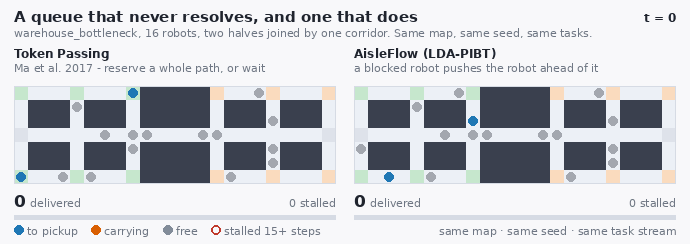
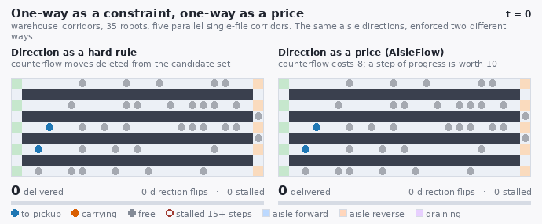
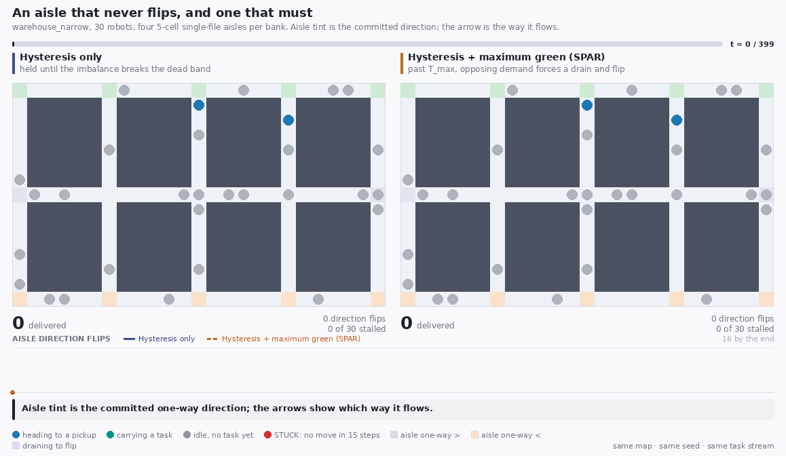
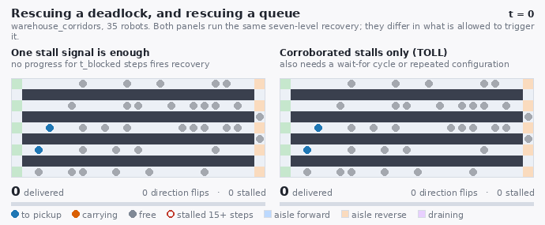
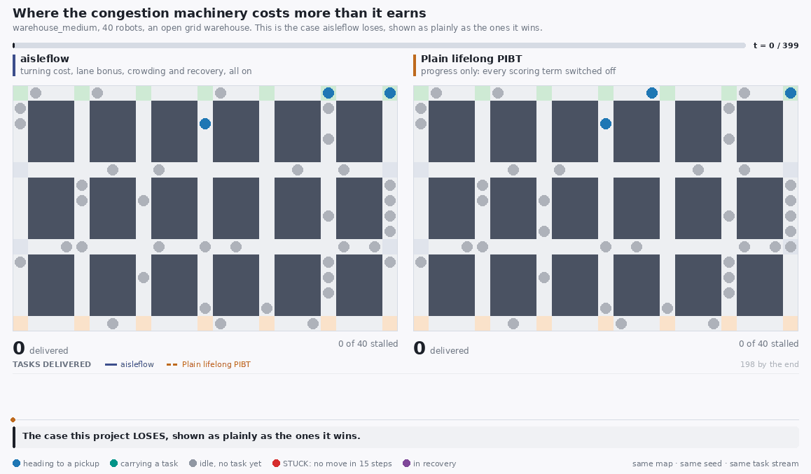

# Comparison animations

Five animations, each a claim this project makes shown as a picture.
Every panel is a real run of the simulator in this repository, and the two
panels of a frame share a map, a seed, a robot count, an arrival rate and a
task stream -- they differ in the planner and nothing else.

Regenerate them all with:

```bash
python3 tools/make_gifs.py            # needs pillow: pip install -e ".[viz]"
```

In every frame: a filled dot is a robot, coloured by what it is doing; a red
ring means that robot has not moved for 15 timesteps; a tinted aisle has
committed a direction, and its arrow points the way it flows. The number
under each panel is tasks delivered so far, and the bar under that compares
it with the leading panel.

## A queue that never resolves, and one that does



**warehouse_bottleneck**, 16 robots, arrival rate 0.8, 400 timesteps, seed 0. `token_passing` vs `full_lda_pibt`.

The single clearest picture in the project. Token Passing plans each robot a collision-free path through a reservation table and holds position when it cannot find one. In a one-corridor map every robot eventually queues nose-to-tail in that corridor, no robot can reserve a path through the robots ahead of it, and nothing ever moves again: watch the left panel go entirely red-ringed and stay there while its delivered count stops. The right panel is the same instant of the same scenario under priority inheritance, where a blocked robot pushes the robot ahead of it out of the way and the queue drains. This is the failure mode PIBT was invented to remove, and it is structural: no amount of tuning removes it from Token Passing.

```bash
python3 tools/make_gifs.py --only gridlock
```

## One-way as a constraint, one-way as a price



**warehouse_corridors**, 35 robots, arrival rate 1.0, 400 timesteps, seed 0. `aisle_direction_hard` vs `aisle_direction_only`.

The core argument of the method, as a picture. Both panels commit the same aisle directions; they differ only in what a committed direction does to a move that opposes it. On the left it removes the move from the candidate set, which is what the specification literally says and what most one-way schemes do - and priority inheritance needs a robot to always have somewhere to be pushed, so deleting that option strands whole corridors. On the right the same move survives and simply costs 8, less than the 10 a step of progress is worth, so a robot drives the wrong way when that is the only way through and pays for it. Measured over five seeds this is worth between 1.9x and 3.1x throughput - the largest single effect in the repository.

```bash
python3 tools/make_gifs.py --only hard-vs-soft
```

## An aisle that never flips, and one that must



**warehouse_narrow**, 30 robots, arrival rate 1.2, 400 timesteps, seed 0. `aisle_direction_no_max_green` vs `aisle_direction_only`.

Hysteresis is only half a traffic signal. A dead band and a minimum lock bound how soon an aisle may change direction and say nothing about how long it may keep one - and a warehouse with pickups down one side and deliveries down the other produces near-balanced demand by construction, so the imbalance never breaks the band. On the left the aisle tints settle and stop changing: robots wanting the other direction wait, and keep waiting. On the right the same aisles reach their maximum green, turn purple as they DRAIN, and commit the opposite direction once empty. Drain-before-reverse is visible in every flip: the aisle empties before it turns, so no two robots ever meet head-on inside it. This is what makes the aisle layer starvation-free rather than merely non-flapping.

```bash
python3 tools/make_gifs.py --only max-green
```

## Rescuing a deadlock, and rescuing a queue



**warehouse_corridors**, 35 robots, arrival rate 1.0, 400 timesteps, seed 0. `recovery_uncorroborated` vs `recovery_only`.

In dense lifelong traffic, 'this robot has not progressed for a while' does not describe a deadlock - it describes an ordinary queue. On the left that signal alone escalates recovery, whose upper levels reverse robots, send them to escape vertices and hijack their waypoints; healthy queues get taken apart and rebuilt continuously and the delivered count barely moves. On the right the same detector must also see a wait-for cycle or a repeated configuration before it fires. Measured on this map: 0.134 tasks per step against 0.022, a six-fold difference produced entirely by refusing to act on the weakest of the three stall signals.

```bash
python3 tools/make_gifs.py --only recovery
```

## Where the aisle layer costs more than it earns



**warehouse_medium**, 40 robots, arrival rate 1.5, 400 timesteps, seed 0. `full_lda_pibt` vs `lifelong_pibt`.

Every mechanism in this project buys something and costs something. On a map with many parallel routes and no scarce single-file aisle, the thing aisle management buys - orderly flow through a contended corridor - is not scarce, while the thing it costs is: a robot whose shortest route runs against a committed direction either detours or pays the counterflow penalty, and there was no congestion to justify either. The right panel simply delivers more, throughout. Over five seeds it is 502 against 313 tasks per 1000 timesteps. The honest summary of this project is that its aisle layer wins on aisle-constrained maps and loses on open ones, and this GIF is the losing half.

```bash
python3 tools/make_gifs.py --only open-map
```
